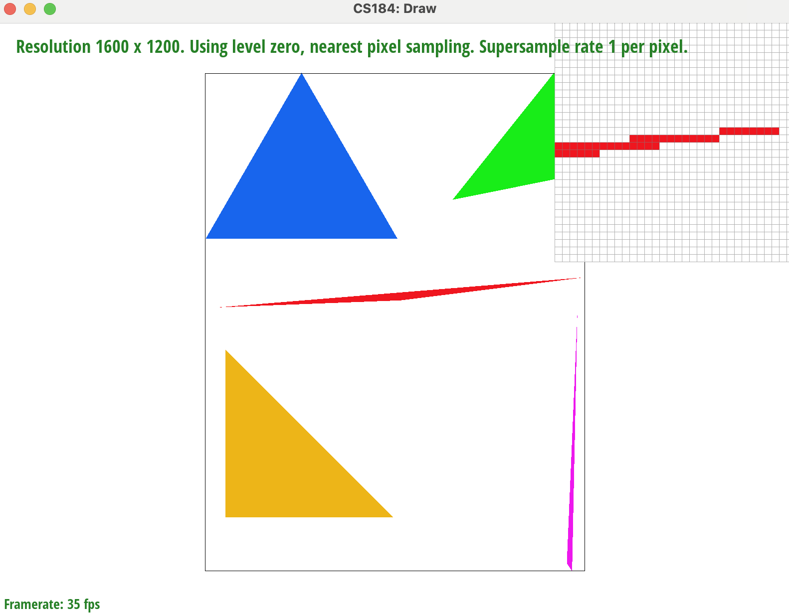
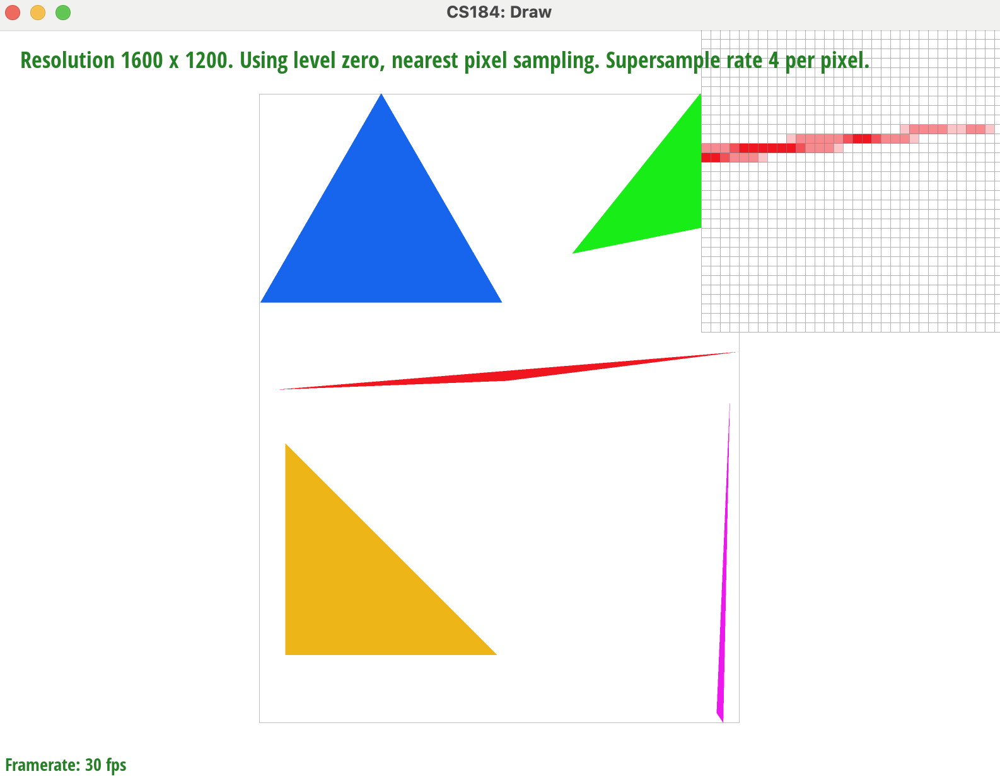
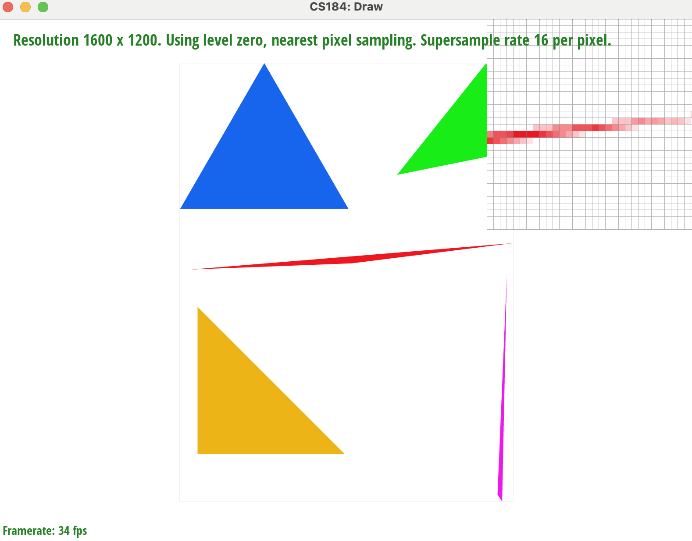
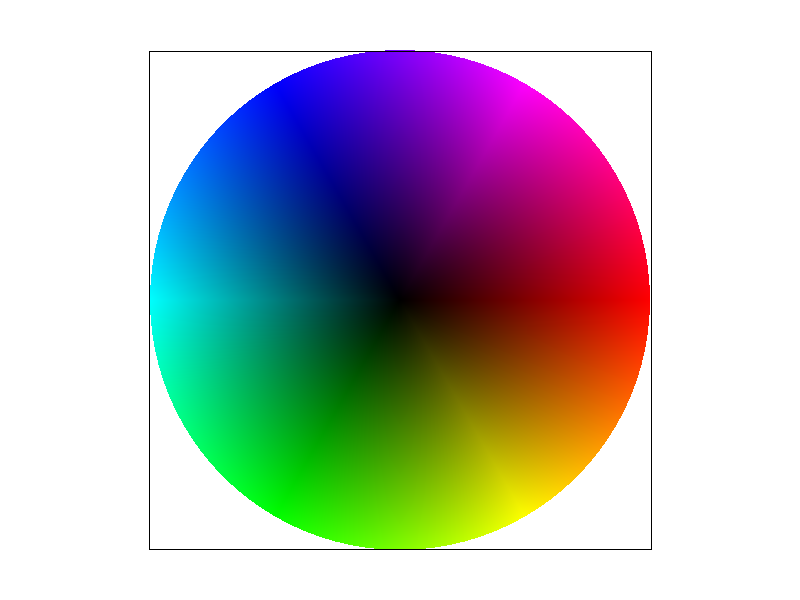

# CS184/284A Spring 2025 Homework 1 Write-Up
## by Ramya Chitturi and Kerrine Tai

Link to webpage: <a href="https://cal-cs184-student.github.io/hw-webpages-rk/hw1/index.html">https://cal-cs184-student.github.io/hw-webpages-rk/hw1/index.html</a>

Link to GitHub repository: <a href="https://github.com/cal-cs184-student/sp25-hw1-r-k">https://github.com/cal-cs184-student/sp25-hw1-r-k</a>

## Overview
In this project, we implemented a rasterizer for the svg files, which can be found throughout the internet. We learned how to rotate, scale, and transform these svg images. We also learned about barycentric coordinates and how to use them in context of texture mapping and pixel interpolation. It was interested to see all of the different images we were able to rasterize through triangulation!

| Input Image 1 | Input Image 2 |
| :----: | :----: |
|  |  |

## Task 1: Drawing Single-Color Triangles

We rasterized triangles using the following steps:
- First, we calculated the smallest x- and y- axes that would form a rectangular bounding box around the triangle. 
- We went through each pixel that was inside the bounding box and found its center by using an offset of 0.5 on each side.
- We then determined if the middle of the pixel was inside the triangle by getting the sign of each of the points of the triangle and comparing it to the pixel's middle. If the signs were all positive or all negative, then this pixel is in the triangle. We need to account for both cases since the winding order of the vertices can be either clockwise or counterclockwise.
- If the pixel is in the triangle, fill it with the color passed in. 

We use two for loops in order to iterate over all of the pixels inside our determined bounding box of the triangle. Thus, our algorithm is linear with respect to the size of the bounding box, as we do not check more pixels than necessary or that are outside the box.

Here is our screenshot of the output of test4. The part we zoomed in on was the end of the red triangle, where jaggies are visible.

<td style="text-align: center;">
    
    <figcaption>part1 test4</figcaption>
</td>

## Task 2: Antialiasing by Supersampling

In order to supersample, we want to sample multiple points for each pixel in order to minimize jaggies and other artifacts. Within the 2 existing for loops from Part 1, we add an additional 2 for loops. We subsample `sqrt(sample_rate)` points in each direction. Similar to Part 1, we check that each of the subsampled points is still within the triangle's bounds. We resize `sample_buffer` to be large enough to include multiple samples per pixel, and we write the subsampled pixels' colors to this buffer. In `resolve_to_framebuffer()`, we find the actual color for a pixel by averaging out the colors for all of its subsampled points, which gives us our final image.

This helps with antialiasing triangles because we have more information about different parts of the pixel. This allows the colors in the final image pixels to be more smooth and transition more gradually, which reduces jaggies and any high frequency image changes.

| Sample Rate = 1 | Sample Rate = 4 | Sample Rate = 16 |
| :----: | :----: | :----: |
|  |  |  |

## Task 3: Transforms

Here, we implemented the following three transforms: translate, scale, and rotate.

Here is our updated robot, who is waving! 

TODO: ADD ROBOT IMAGE

## Task 4: Barycentric coordinates

Barycentric coordinates refer to a new coordinate system altogether. They allow us to interpolate values more easily, like the points of traingles. We take the original xy coordinates and produce linear combinations to get a new coordinate. The sum of the coefficients of the combination must be 1 to make sure that the points still lie inside the shape. We're able to have smoother transitions within the triangle's colors or textures due to antialiasing, and we also can sample points more easily. As we approach one vertex of the triangle, it will contribute to the linear combination more that the vertices that are further away. 

Here is the color wheel we visualized from test7, with a sampling rate of 1 and default parameters.

TODO: MAY NEED TO RETAKE IMAGE WITH THE TOP INFO

<td style="text-align: center;">
    
    <figcaption>part4 test7</figcaption>
</td>

## Task 5: "Pixel sampling" for texture mapping
Pixel sampling is used to get pixels for a given screen space coordinate given a texture image (texels). I implemented texture mapping by repeating the same process for each coordinate within the triange:
- based on the sample_rate, loop x amount of times
- get barycentric coordinates for uv
- get color by sampling texel (either nearest or bilinear) of Vector uv
- fill pixel 
Nearest pixel sampling method is getting the nearest texel corresponeidng to the pixel. In bilinear pixel sampling, we sample multiple texels close to the corresponding pixel and calculate the correpsonding color based on the "closeness" to the texels we sampled. 

| Nearest; Sample Rate = 1 | Nearest; Sample Rate = 16 | Bilinear; Sample Rate = 1 | Bilinear; Sample Rate = 16 |
| :----: | :----: | :----: | :----: |
|  |  |  | 

## TODO: Comment on the relative differences

## Task 6: "Level Sampling" with mipmaps for texture mapping