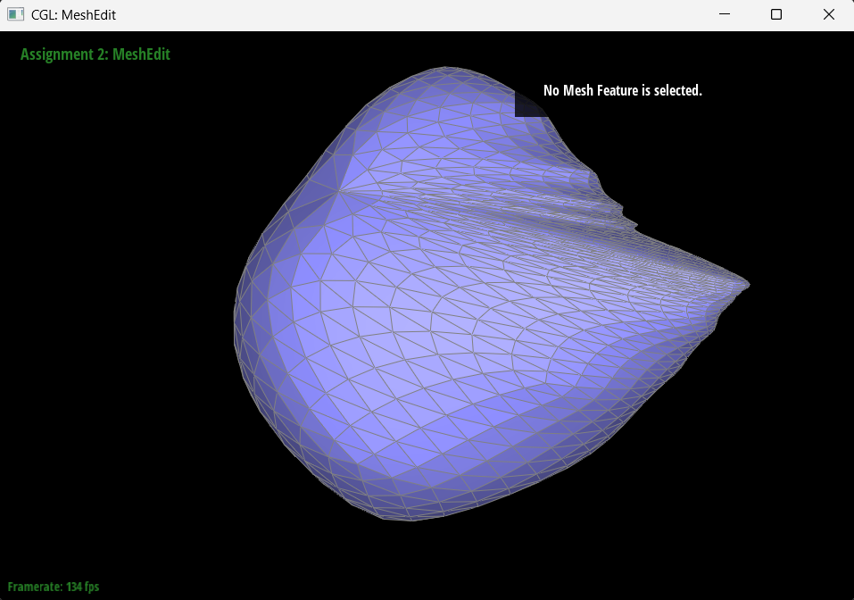

<script type="text/javascript" async 
  src="https://cdnjs.cloudflare.com/ajax/libs/mathjax/3.2.0/es5/tex-mml-chtml.js">
</script>
<script type="text/javascript">
  window.MathJax = {
    tex: {
      inlineMath: [['$', '$'], ['\\(', '\\)']],
      displayMath: [['$$', '$$'], ['\\[', '\\]']]
    }
  };
</script>

# CS184/284A Spring 2025 Homework 2 Write-Up
## by Ramya Chitturi and Kerrine Tai

Link to webpage: <a href="https://cal-cs184-student.github.io/hw-webpages-rk/index.html">https://cal-cs184-student.github.io/hw-webpages-rk/hw2/index.html</a>

Link to GitHub repository: <a href="https://github.com/cal-cs184-student/sp25-hw2-r-k-2">https://github.com/cal-cs184-student/sp25-hw2-r-k-2</a>

## Overview


In this project, we explored several geometric modeling techniques using the half-edge data structure. We used the de Casteljau algorithm to build Bezier curves and surfaces, manipulated triangle meshes represented by the half-edge data structure, and implemented loop subdivision through splitting and flipping edges.

## Section I: Bezier Curves and Surfaces

### Part 1: Bezier curves with 1D de Casteljau subdivision

The goal was to create Bezier curves in 1D using the de Casteljau algorithm. Using the control points, we used the fraction `t` to linearly interpolate the points. Thus, the `n` input points will become `n-1` output points to produce one level of subdivision in the algorithm. We keep recursively running this algorithm by sampling regular intervals of `t` until we only have 1 point left as our base case. We can find some point $p'_i$ by doing $p'_i = (1-t)p_i + p_{i+1}$.

We used the following code to create our own Bezier curve with 6 control points and visualize the algorithm.
```
6
0.200 0.300
0.300 0.700
0.500 0.580
0.600 0.400
0.700 0.700
1.000 0.900
```


We moved the second point from the right and changed `t` to get the following result.


### Part 2: Bezier surfaces with separable 1D de Casteljau

We can extend the de Casteljau algorithm to Bezier surfaces as well. First, we need to evaluate the final points for all of the rows (one of the axes) by calling `evaluate1D` on each row. The `t` value for this axis is `u`. Then, we evaluate those points to get the final points for the column (the other axis). The `t` value for this axis is `v`. We call `evaluate1D` on the vector created by the calls to each row. Then, we call `evaluateStep` until there is only 1 remaining point. 

Here is our result of rendering teapot.bez with this step.


## Section II: Triangle Meshes and Half-Edge Data Structure

### Part 3: Area-weighted vertex normals

We calculate the area-weighted normals of all of the neighboring triangles to the vertex. We then average this out and normalized the result. We iterated through all of the neighboring triangles using a loop. 

#### TODO: add more detail

| teapot.dae without Phong shading | teapot.dae with Phong shading |
| :----: | :----: |
|  |  |

### Part 4: Edge flip

We used the following resource from CMU provided in the half-edge primer heavily when implementing edge flip: http://15462.courses.cs.cmu.edu/fall2015content/misc/HalfedgeEdgeOpImplementationGuide.pdf. We particularly used the after flip image to define all of our halfedges, vertices, etc. in all of our calls to `setNeighbor` to ensure everything was correct in relation to each other.

We were first confused about how to implement this part without creating new elements. Using the diagram in resource above helped a lot in visualizing what each of halfedges needed to be reassigned for their next, twin, vertex, edge, and face values. It also helped provide a starting point for the different sections in our code for Parts 4 and 5.

Here is the original teapot image, following by the teapot image after flipping some edges. There are some cases where one triangle is a lot darker than the other after flipping, but these are degenerate cases we don't need to worry about (as per the spec).


### Part 5: Edge split

We implemented edge splitting by first drawing the original triangle diagram without any edge split. Then we drew the new vertex in the middle and added in the new data structures into the diagram. Finally, we reassigned the relevant values in the new and original data structures. When drawing, we wrote psudeocode, and that translated easily to actual code. After completing edge flip, edge splitting was significantly easier as we already understood half edges well, especially the functions to modify the data structures. 

Here is our diagram:


Thankfully, we did not have an eventful debugging journey. One trick we found to be very useful was to "redraw" the triangle diagram with all our changes. That way, it was easy to see if a halfedge or edge or anything else was missing. 

| Before changes | After edge splits | After edge splits and edge flips |
| :----: | :----: | :----: |
|  |  |  |


### Part 6: Loop subdivision for mesh upsampling

We implemented loop subdivision in 5 main steps. 
1. We first computed the new positions for all the vertices in the input mesh by iterating through all vertices and looping through all the edges adjacent to the vertex to calculate the degree. We then used the degree to calculate u, and then used this equation to calculate and update the new position of the vertex. We also set all the vertices we iterated through to be new.

$(1 - n * u) * original_position + u * original_neighbor_position_sum$

2. We then iterated through all the edges and calculated the new position of the edge using 4 vertex values. We used the equation $3/8 * (A + B) + 1/8 * (C + D)$. We set the edge's new position to this values and set e to new. While iterating through the edges, we also added all the edges we visited to a list `originalEdges`. 

3. We iterate through `originalEdges` and split all the edges, setting the split vertex to new and setting the new position fo the split vertex to the edge's new position. 

4. Next, we flipped edge that connected a new and old vertex. 

5. Finally, we copied the new vertex positions into final vertex position. 

For debugging, we found it very useful to comment out parts of the code and observe what happens. While commenting out parts of the code, we can also run the code and interact with the GUI to see vertices, edges, and faces. 

Here is loop subdivision on the torus dae.


Meshes always become increasingly rounded with more loop subdivisions. Sharp corners and edges become lumpy smooth surfaces. Below is an example of a cube losing the corners. 


However, if we pre-split some edges in the areas that we want to be sharp, it retains some of the sharpness. 

 
 

Below is loop subdivision performed on the cube. It is asymmetric because of the original diagonal edge on the cube. There is no matching diagonal connecting the other 2 edges of a face of the cube, so loop subdividing it will make it have a lemon shape. We can preprocess the cube by adding splitting the diagonal cutting through a face of a cube, making the cube loop symmetric when we subdivide it. 


| Unprocessed cube | Processed cube |
| :----: | :----: |
|  |  |
|  |  |
|  |  |


