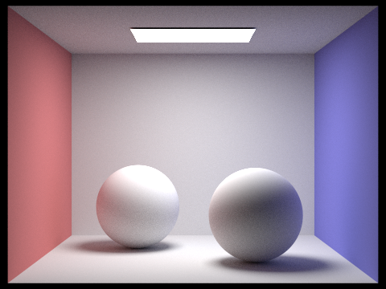

# CS184/284A Spring 2025 Homework 3 Write-Up
## by Ramya Chitturi and Kerrine Tai

Link to webpage: <a href="https://cal-cs184-student.github.io/hw-webpages-rk/index.html">https://cal-cs184-student.github.io/hw-webpages-rk/hw3/index.html</a>

Link to GitHub repository: <a href="https://github.com/cal-cs184-student/sp25-hw3-r-k-3">https://github.com/cal-cs184-student/sp25-hw3-r-k-3</a>

## Overview

In this homework, we explored rendering through ray tracing, bounding boxes, and illuminating scenes through different techniques. We first had to wrap our heads around converting from world space to camera space and vice versa to successfully implement ray object intersection, then accelerated the process through bounding boxes. Next, we learned how to render images with illumination, and finally accelerated that process through adaptive sampling. For each part, visualizing in our head was crutial, so we often referred back to lecture slides and recordings. We encountered many problems, mostly related so objects showing up but being completely black. We solved it by debugging the intersection and illumination functions. Some of the images are bit small, but you can open them up in a new tab to see them more clearly!

## Part 1: Ray Generation and Scene Intersection

For ray generation, we had to take a ray that originated from a camera and trace the ray until it intersected  the image plane at a specific point. In `generate_ray`, we first calculated the sensor's bottom left corner and top right corner given the equations in the spec. We then determined the exact point on the sensor plane the ray passes through and used this to create a direction vector. Then we converted this direction vector into the world space with the `c2w` to create the ray. For every single pixel, we use `ns_aa` and `gridSampler`to sample some rays per pixel. We generate the ray using `generate_ray` function from above, then got the radiance with `est_radiance_global_illumination`. 

The primitive intersection part was where we checked if a ray intersected any object in the scene.  We implemented ray-triangle and ray-sphere intersection. For the ray-triangle intersection, we used Moller Trumbore algorithm, which barycentric coordinates (like previous homeworks!). We first calculated the edge vectors for the triangle and determinates we needed for the barycentric coordinates.We calculatd the barycentric coordinates and where along the ray the intersection happens. Of course, we need to check if the intersection is even valid, and we do this by checking for valid barycentric coordinate range and that the point is within the valid part of the ray. 

Here are some images with normal shading:

## Part 2: Bounding Volume Hierarchy

For our BVH construction algorithm, since it is recursive, we made a base case where we stop when the number of primitives in the current range is less than or equal to the `max_leaf_size`. This is where we create the leaf node that stores the primitives. Otherwise, we compute the bounding box. WE then loop through the primitives to create 2 `BBox`, one for the ray intersections and one for the centroids. The splitting axis was choosen with a helper function we wrote `largestDimension`. For our heuristic, we decided to use the average centroid position along the axis that we chose. We thought it was intiutive to just use the average when splitting things in two. Once we split the primitives, we recursivly called the function on the left and right subtree. 

Here are some images that we could only render in reasonable time with BVH acceleration: 

BVH significantly sped up the time it took to render images, and it showed the most in the more complex geometries. For example, it took maxplanck 282.98 seconds to render without BVH, and 1.974s with. It took lucy 588.12s to render without BVH, and 1.915s with. Even for moderately complicated geometries, the differences showed. It took 21.289 seconds to render the cow without BVH, and 0.436 seconds with. Conceptually, if we do not use BVH, rendering is linear to the number of primities, but since we divide the primitives by around half each recursive level in BVH, rendering is logarithmic. 

## Part 3: Direct Illumination

For the hemiphere sampling, we sample at num_sample points uniformly over the hemisphere. For each sample, we use `hemisphereSampler` to get a random sampled direction, then use it to create a shadow ray and see if the ray intersects something with `bbh->intersect()`. If it does hit an object, we are able to get the emission with the BSDF. We then use the values we collected per sample to solve for the reflection equation given in lecture. Finally, we averae all the rays we sampled to get the illumination. 

Direct lighting by importance sampling lights was a little more difficult because this was not an uniform sampling. We looped through every light scource in the scene. If the light source is a delta light, we saved time by sampling it only once because all samples from a point light will be the same. Otherwise, we sample the light num_samples times. Each time, this was similar to the process in hemisphere sampling where we get the create the shadow ray, see if it intersects, and solve for the reflection equation. We then average over all the samples for the specific light, then add together the radiance for all the lights in the scene. 

Here are some images with both implementations of the direct lighting function. 

| Hemisphere sampling | Importance sampling |
| :----: | :----: |
|  |  |
|  |  |

Scenes with 1, 4, 16, and 64 light rays, in order. 

The main difference between uniform hemisphere sampling and lighting sampling reflected in the images is from the graniness of the images. For hemisphere sampling, the renderd images are more grainy and noisy. With hemisphere sampling, although it samples many parts of the image, many samples are useless. However, with importance sampling, the image is a lot more smooth. This is because importance sampling samples actual light sources, which makes the samples more useful to determining the actual lighting of the image. 

## Part 4: Global Illumination

Global illumination also refers to indirect lighting. This is when the light reflects off a surface, where the light is coming from another surface that reflected light. Therefore, we are looking at the light bouncing from surface to surface. We followed a similar process as Part 3, except we called the function recursively to track tha path of the ray as it bounced around off of objects. We then optionally occumulated the reflectance up to some number of bounces at an intersection points. We also used Russian Roulette to stop the recursion earlier with a probability of 0.4. Here is a pseudocode of steps that we followed to implement global illumination:

- Base Cases
  - If the ray has a depth of 0, we returned the zero-bounce radiance.
  - If the ray has a depth of 1, we returned its one-bounce radiance
  - Using `coin_flip`, we returned `L_out` with a 40% chance, thus breaking the recursive cycle. `L_out` was equal to one-bounce radiance if `isAccumBounces` was true and 0 otherwise.
- Then, we used `sample_f` to sample `wi` and the PDF from `isect`. We converted `wi` to world coordinates and generated a ray in that direction with a depth 1 less than the ray that was an input to the function. As before, we used an offset of `EPS_F` for the origin and direction values.
  - If the generated ray doesn't intersect the BVH, then we stop recursing.
- If the ray does intersect, we call the function recursively with the new ray and new intersection. 
  - If we are acculumating bounces, then we add the the result of the recursive call (the accumulated `L_out`) to our current `L_out` value in a similar fashion to Part 3. The main difference in calculation is that we all divide by the Russian Roulette probablity to normalize, which was 0.6 in our case.
  - If we are not accumulating bounces, then we just return the reflectance at the current depth. We do not add it to `L_out` to maintain over time.

Here are some of the images we were able to generate with global illumination and 1024 pixels per sample!

Here, we can see the spheres with only direct illumination, followed by only indirect illumination.

Below, we include a side-by-side of the bunny image generated with difference max depths with and without accumulation. The `m` values per row in order are 0, 1, 2, 3, 4, and 5. All the samples use 1024 samples per pixel and 4 light rays. We can see that when `isAccumBounces` is false (column on the left), increasing the max ray depth causes the image to become darker for each extra bounce of light. This occurs since each bounce of light has a smaller effect on the indirect lighting. On the flip side, the brightness increases for each extra bounce when `isAccumBounces` is true, since we add more light each time, though the increase in brightness becomes smaller at each step. We can see the the most noticeable difference in both columns is between one and two bounces of light. The difference between second and third bounces is not as noticeable. The accumulated light is not much brighter, and correspondingly the non-accumulated bounce is not that much darker.

| `isAccumBounces=false` | `isAccumBounces=true` |
| :----: | :----: |
|  |  |
|  |  |
|  |  |
|  |  |
|  |  |
|  |  |

We also implemented Russian Roulette with a termination probability of 0.4. We use 1024 samples per pixel, 4 light rays, and accumulation to generate the images below. They look pretty similar to the right column above, which is good since Russian Roulette causes faster rendering but a similar output.

We can also compare how the number of samples per pixel affects the rendered imageds. We use a Russian Roulette termination probability of 0.4 and 4 light rays. In order, we use a sample ray count of 1, 2, 4, 8, 16, 64, and 1024 with the bunny. As we increase the number of sample rays used, we get less black spots/noise in our rendered image, so the image with 1024 samples looks the cleanest. However, it also takes the longest the render.

## Part 5: Adaptive Sampling

The goal of adaptive sampling is to reduce noise by increasing the number of samples. However, not all the samples converge in a uniform manner, so we need to measure the level of convergence per pixel. We define a pixel's convergence as $$ I = 1.96 * \sigma / \sqrt{n} $$. This generates a 95% confidence interval that the average pixel illumination is within I of the mean. This allows us to terminate some integrations early since some pixels have a lower variance and have already converged. We can have a fixed sample size and trace rays faster because of this. Alternatively, we can increase the number of samples to decrease noise when rendering while still completing this task in a reasonable amount of time. In our sampling loop, we keep a running sum of the illuminance, a running sum of square illuminance, and the actual number of samples collected thus far. Every `samplesPerBatch`, we check to see if $$ I \le m * \mu $$, where $m$ is the maximum tolerance. If this is the case, then we stop our ray sampling loop. Afterwareds, we update `sampleCountBuffer` with the actual number of samples we collected, and we update our accumulated radiance with this value as well.

Here is the result of using adaptive sampling on the bunny with a Russian Roulette termination probablity of 40%.

| Adaptive sampling | Rate |
| :----: | :----: |
|  |  |

However, we noticed better results when using a lower termination probability. Below are the results of using adaptive sampling with a Russian Roulette termination probablity of 5%.

| Adaptive sampling | Rate |
| :----: | :----: |
|  |  |
|  |  |