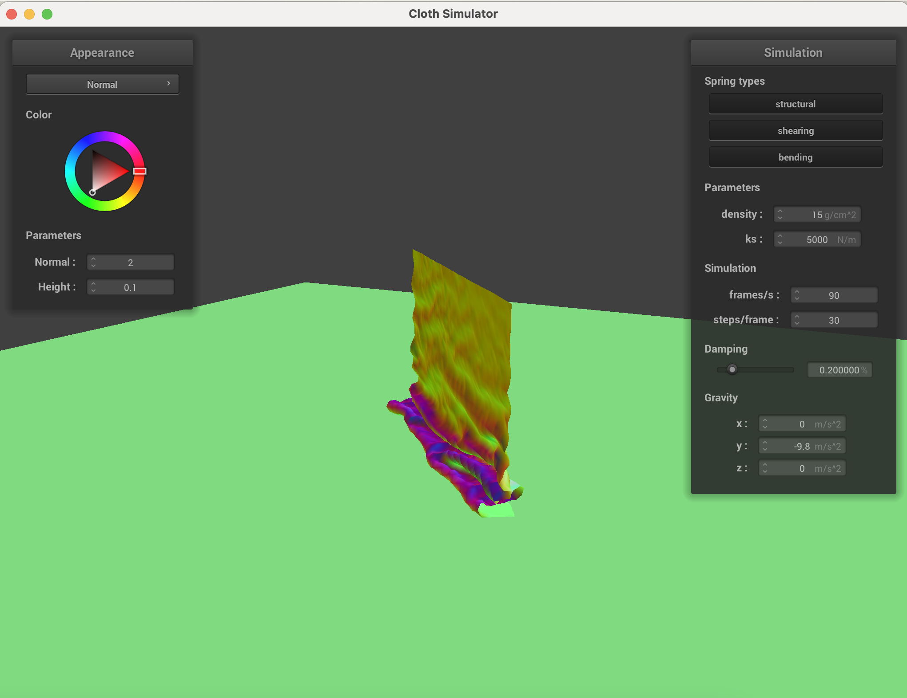
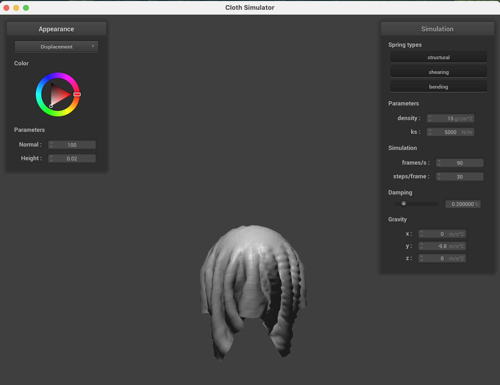

# CS184/284A Spring 2025 Homework 4 Write-Up
## by Ramya Chitturi and Kerrine Tai

Link to webpage: <a href="https://cal-cs184-student.github.io/hw-webpages-rk/hw4/index.html">https://cal-cs184-student.github.io/hw-webpages-rk/hw4/index.html</a>

Link to GitHub repository: <a href="https://github.com/cal-cs184-student/sp25-hw4-r-k-4">https://github.com/cal-cs184-student/sp25-hw4-r-k-4</a>

## Overview

In this homework, we explored real time simulation of cloth through different techniques. We defined the cloth as springs connected with point masses, and then simulated how this cloth interacted with other objects with collisions. Finally, we added different visual features to the cloth. This project was super cool, as in some ways, cloth is also just connected fibers interacting with other objects. Being able to see the collisions and outputted rendering immediate was exciting, especially because of how long we had to wait to see the results last project. Some of the images are bit small, but you can open them up in a new tab to see them more clearly!

## Part 1: Masses and springs

Screenshots of scene/pinned2.json! Cloth wireframe.

 
Wireframe with different constraints. 

Without any shearing constraints

With only shearing constraints

With all constraints

## Part 2: Simulation via numerical integration

| ks 100 | ks 10000 |
| :----: | :----: |
|  |  |

Changing the ks, or spring constant, changes how stiff or flowy the fabric is. In the image on the left where ks = 100, while the cloth was moving, it was falling faster and was very bouncy. When ks = 10000, the cloth was very stiff and moved slower. This is because when the spring constant is higher, the cloth is less suseptible to changes such as gravity.

| density 1 | density 100 |
| :----: | :----: |
|  |  |

The density changes the cloth's weight in this simulation. When the density = 1 (low density), the cloth falls gently, and it does not sag as much. On the other hand, when density = 100, the cloth drapes faster and sags down much further. The fall for the heavier density is also somewhat bouncy. 

| damping low | damping high |
| :----: | :----: |
|  |  |

In this simulation, the damping term simulates loss of energy. When damping is low, little energy is lost, so the cloth is stays bouncy and has movement for longer. It reminded me of a bouncy ball. When the damping value is high, the cloth had little movement besides immediately going to the final resting position. 

Scene/pinned4.json in final resing state with default parameters

## Part 3: Handling collisions with other objects

For collision with spheres, for every single point mass, we collided it with every single possible object. We did this by first checking to see whether the point mass is inside the sphere or not. If it is, we calculate the direction vector to "push" the point out and also how far out to push the point. We then change the point masses's position at every timestep towards the correct psition on the sphere surface, scaled by friction.

For collision with planes, the process is similar to spheres. However, instead of checking if the point mass is inside the plane, we check if the point has "crossed" the plane. We first get the point on plane and the current poisiton of the point mass, then check if the point mass has crossed the plane by using the dot product and checking the sign of the signed distance. If the point mass crossed the plane, we calculate where the point mass is projected to fall onto the plande with a correction vector (intersection point - last position of the point mass). Then we move the point above the plane (by SURFACE_OFFSET) and apply a collision correction. 

| ks = 500 | ks = 5000 | ks = 50000 |
| :----: | :----: | :----: |
|  |  |  |

As described in part 1, changing the ks value changes the stiffness or flowiness of the cloth. With a low ks value of 500, the cloth is very flowy and is able to fall on the sphere and show the shape of the sphere more clearly. In ks = 50000, the sphere is stiff and is not able to wrap around the ball tightly. In ks = 5000 image, the spring constant is between the values in the other image, and the cloth is also reflected as such. The cloth is able to wrap around the ball better than when ks = 50000, but the shape is not as clear as when ks = 500. 

Cloth lying peacefully at rest  

## Part 4: Handling self-collisions

To handle self-collisions, we first built a spatial map. We then iterated through each of the point masses and checked if there was a self collision given the number of simulation steps. To build the spatial map, we first hashed the point mass's position. We calculated w, h, and t as detailed by the spec. Then to get the x, y, and z values respectively, we calculated `w * floor(pos.x / w)` to get x, for example. Then, we returned `x + (y*y) + (z*z*z)` to spread the points out over more buckets. Once we had this, we made a hashmap where the key was the hashed position and the value was a list of all the point masses that hashed to that position. To check if a point mass had a self collision, for each of the other points in its hash bucket, we would calculate the correction vector between the two point masses and add them together. We then divided the total correction vector by the number of other point masses and the simulation steps. We then adjusted the point mass's position by the correction vector. 

Here are three images of the cloth falling and folding in on itself. In the first image, the cloth just collided with the plane. In the last image, the cloth is lying (mostly) at rest on the plane.

With the larger ks = 50000 value, the cloth doesn't fold on itself as much. It is much more rigid and has big folds. With a smaller spring constant, the cloth is less rigid and folds over itself very easily.

| ks 500 | ks 50000 |
| :----: | :----: |
|  |  |

If we increase the density of the cloth, it appears a lot heavier and weighs itself down. Thus is has more creases and is closer to the plane. With a lower density, the cloth fell to the ground a bit slower and ended up with less folds.

| density 1 | density 100 |
| :----: | :----: |
|  |  |

## Part 5: Cloth Sim

In a shader program, we take in arguments with information about objects in the scene. For example, we have information about the position, lighting, and more. We then output a 4D vector for 1 coordinate in an image. The vertex shaders use transforms to change the appearance and position vectors. This occurs before rasterization. During rasterization, the fragment shaders fill in the spaces between the vertices and compute a color that we store in `out_color`.

### Blinn Phong

In Blinn-Phong, we combine 3 types of lighting and generate the lighting effect based on the properties of the material. Ambient lighting is constant throughout the scene. Diffuse lighting is matte, and its intensity depends on distance from the light. Specular lighting is dependent on the angle of the light relative to the object, as well as creating more visible reflections with a nearer light angle. 

Only ambient  

Only diffuse  

Only specular  

Full Blinn-Phong model 

### Custom Texture

Now, here are a few screenshots of our custom texture - meet Potato!

  
  
  

### Bump & Displacement Mapping

We use the gingham texture_4 for our bump and displacement mappings. In bump mapping, we improve the texture by changing the surface normals (how the light source is reflected off the surface). In displacement mapping, we change the positions of the vertices themselves. Thus, it shows the texture a bit more because we are actually moving the vertices around. We also see the presence of shadows due to the texture.

Bump Mapping  

Displacement Mapping  

Here are the shaders with `-o 16 -a 16`.

| bump | displacement |
| :----: | :----: |
|  |  |

Here are the shaders with `-o 128 -a 128`.

| bump | displacement |
| :----: | :----: |
|  |  |

If we increase the coarseness of the sphere, displacement mapping is affected slightly more. This is because if we increase coarseness, each pixel covers a larger part of the surface. This caused the texture to be a bit more visible. In bump resolution, the difference in coarseness didn't really change the resulting texture.

### Mirror Shader

We did not make a custom shader. 